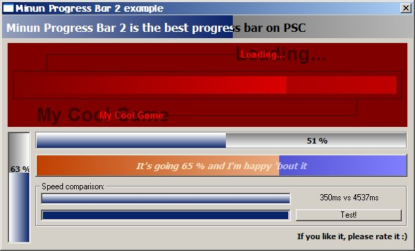



## Minun Progress Bar 2

### Description

The best progress bar on PSC: it's fast, it looks cool and it's stable. All you need when it comes to showing a progress. Includes: 1) colors and colorfades! 2) use any font, make it appears as you want 3) you can use seven different borderstyles 4) make the bar grow up, down, right or left 5) Blending (changes color opacity or CosSin mode makes weird colors!) 6) Set the caption just like you want it to be 7) ManualRefresh for optimal usage: if you change colors a lot or do other big changes at a time, you might want to refresh the bar only when you wish 8) Min, Max and Value as big or small as you want 9) You can change parent easily with SetParent 10) enough events: make it a command button as well! 11) clear, optimized code: learn how things can be done fast in VB. Also great example on how to make an ActiveX control with VB.

If you like it, please vote & rate :)
 
### More Info
 
The control is coded with Visual Basic 5 Control Creation Edition and example program with Visual Basic 6.

             |
---                |---
**Submitted On**   |2003-09-01 12:23:58
**By**             |[Vesa Piittinen](https://github.com/Planet-Source-Code/PSCIndex/blob/master/ByAuthor/vesa-piittinen.md)
**Level**          |Intermediate
**User Rating**    |4.3 (85 globes from 20 users)
**Compatibility**  |VB 5\.0, VB 6\.0
**Category**       |[Custom Controls/ Forms/  Menus](https://github.com/Planet-Source-Code/PSCIndex/blob/master/ByCategory/custom-controls-forms-menus__1-4.md)
**World**          |[Visual Basic](https://github.com/Planet-Source-Code/PSCIndex/blob/master/ByWorld/visual-basic.md)
**Archive File**   |[Minun\_Prog163914912003\.zip](https://github.com/Planet-Source-Code/vesa-piittinen-minun-progress-bar-2__1-48153/archive/master.zip)

